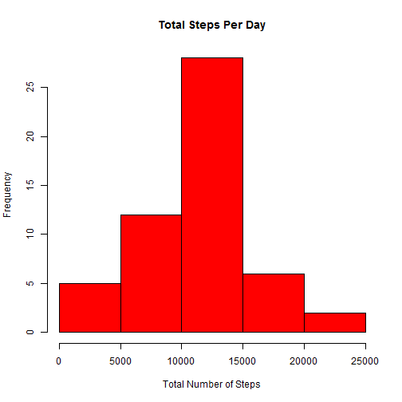
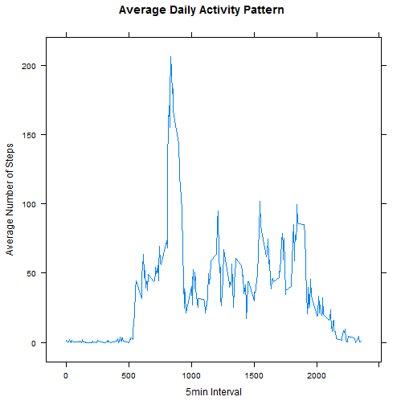
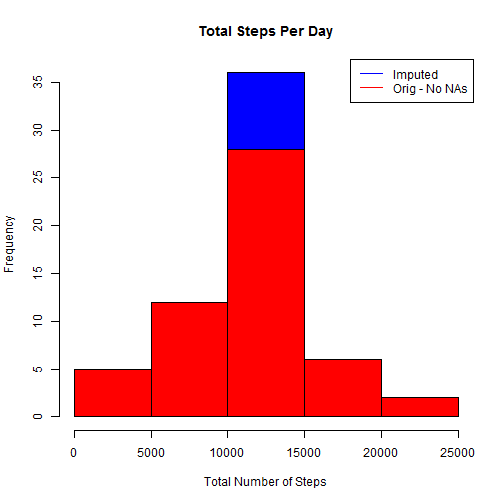
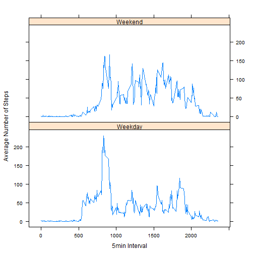

# Reproducible Research: Peer Assessment 1
*Agisilaos Stamatopoulos*  
      
## Loading and preprocessing the data  
**Libraries to be used:**

```r
library(dplyr)
library(lattice)
```
**Load the data, format column date as date and convert to TBL_DF:**

```r
df <- read.csv("activity.csv",sep=",",stringsAsFactors=FALSE)
df$date <- as.Date(df$date, "%Y-%m-%d")
data <- tbl_df(df)
```

## What is mean total number of steps taken per day?  
*Rows with missing values are ignored*  
**Total steps taken per day**  

```r
total_steps_per_day <- data %>% na.omit() %>% group_by(date) %>% summarize(sum(steps))
colnames(total_steps_per_day) <- c("date","Total_Steps")
```

**Histogram of the total steps taken per day**    

```r
hist(total_steps_per_day$Total_Steps,col = "red",main = "Total Steps Per Day", xlab ="Total Number of Steps")
```

 

**Mean of the total number of steps taken per day**  

```r
mn <- mean(total_steps_per_day$Total_Steps)
```
The mean is :1.0766 &times; 10<sup>4</sup>

**Median of the total number of steps taken per day**  

```r
md <- median(total_steps_per_day$Total_Steps)
```
The median is : 10765

## What is the average daily activity pattern?
*Rows with missing values are ignored*  
**Calculate the Average number of steps taken per 5min interval**  

```r
avg_steps_per_interval <- data %>% na.omit() %>% group_by(interval) %>% summarize(mean(steps))
colnames(avg_steps_per_interval) <- c("interval","Average_Steps")
```

**Plot of the 5-minute interval vs the average number of steps taken**   

```r
xyplot(avg_steps_per_interval$Average_Steps ~ avg_steps_per_interval$interval,type="l",,main="Average Daily Activity Pattern", xlab = "5min Interval", ylab = "Average Number of Steps")
```

 

**Calculate which 5-minute interval contains the maximum number of steps**   

```r
x <- avg_steps_per_interval[which.max(avg_steps_per_interval$Average_Steps),][1]
```

**The 5-minute interval which contains the maximum number of steps is : 835**  

## Imputing missing values

**1. Calculate number of missing values in dataset**

```r
nacount <- nrow(data[!complete.cases(data),])
```

**The total number of missing values in the dataset: is : 2304**  

**2. A new dataset will be created by replacing the NA values of the original dataset with the
 mean for that 5-minute interval on that day**  

**3. Create the new dataset**
 
a. Join the original dateset with the Average number of steps taken per 5min interval dataset

```r
i_data <- inner_join(data,avg_steps_per_interval,by="interval")
```

b. NA values of steps on a specific day will be replaced with the average numbers of steps
 for that interval


```r
i_data$steps<-ifelse(is.na(i_data$steps),i_data$Average_Steps,i_data$steps)
i_data<-i_data%>%select(steps,date,interval)
```

c. Verification that no data with missing values exists on the new dataset

```r
nrow(i_data[!complete.cases(i_data),])
```

```
## [1] 0
```

**4. Differences of Imputed and Original(No NAs) dataset**  
a. Histogram of the total steps taken per day of imputed data (blue) 
vs origiginal data ommiting NAs (red)


```r
i_total_steps_per_day <- i_data %>% group_by(date) %>% summarize(sum(steps))
colnames(i_total_steps_per_day) <- c("date","Total_Steps")
hist(i_total_steps_per_day$Total_Steps,col = "blue",main = "Total Steps Per Day", xlab ="Total Number of Steps")
hist(total_steps_per_day$Total_Steps,col = "red",main = "Total Steps Per Day", xlab ="Total Number of Steps",add=T)
legend("topright", c("Imputed", "Orig - No NAs"), col=c("blue", "red"), lwd=1)
```

 

b. Differences between the mean and median of the data sets  
**Caclulate imputed data mean of the total number of steps taken per day**

```r
i_mn <- mean(i_total_steps_per_day$Total_Steps)
```
Imputed dataset mean **1.0766 &times; 10<sup>4</sup>** is the same as the original dataset with no NAs mean **1.0766 &times; 10<sup>4</sup>**  

**Calculate imputed data median of the total number of steps taken per day**

```r
i_md <- median(i_total_steps_per_day$Total_Steps)
```
Imputed dataset median **1.0766 &times; 10<sup>4</sup>** is different than the original dataset with no NAs mean **10765**  

c. Differences between the total number of steps between the datasets  
Imputed dataset total number of steps

```r
sum(i_total_steps_per_day$Total_Steps)
```

```
## [1] 656738
```
Original dataset(ommiting NAs) total number of steps

```r
sum(total_steps_per_day$Total_Steps)
```

```
## [1] 570608
```
**By imputing the NA values on the dataset the total number of steps increased**

## Are there differences in activity patterns between weekdays and weekends?
*Imputed dataset used for the follwoing calculations & graphs*  
Add a column with the type of weekday in the data set  

```r
i_data <- mutate(i_data,day=ifelse(weekdays(i_data$date) == "Saturday" | weekdays(i_data$date) == "Sunday",c("Weekend"),c("Weekday")))
```
Plot of the 5-minute interval (x-axis) and the average number of steps taken, averaged across all weekday days or weekend days   

```r
activity <- i_data %>% group_by(day,interval) %>% summarize(mean(steps))
colnames(activity) <- c("day","interval","Average_Steps")
xyplot(activity$Average_Steps ~ activity$interval | activity$day, layout = c(1, 2),type="l",xlab="5min Interval",ylab="Average Number of Steps")
```

 
